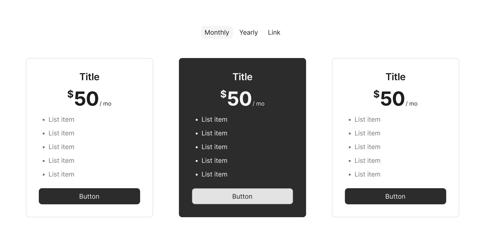
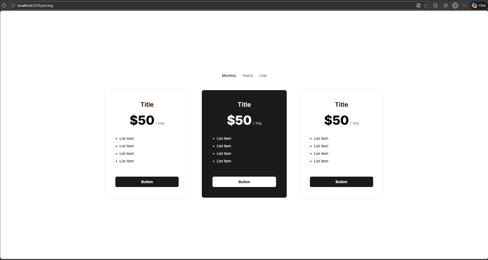
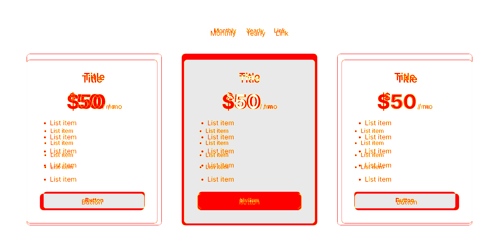

# figma-drift

> Detect visual drift between Figma designs and live implementations.

## Quick Start

### Installation Options

Figma Drift can be used in three ways, depending on your workflow:

#### 1. On-the-fly (Recommended for Testing)
Run directly without installing. This is the fastest way to verify a design.
```bash
npx figma-drift check \
  --figma "<YOUR_FIGMA_FRAME_URL>" \
  --live "<YOUR_LIVE_SITE_URL>"
```

#### 2. Global Install
Install globally for access to the `figma-drift` command from any directory.
```bash
npm install -g figma-drift
figma-drift check --figma "..." --live "..."
```

#### 3. Local Project Dependency
Add it to your project's `devDependencies` for use in CI/CD or shared scripts.
```bash
npm install --save-dev figma-drift
npx figma-drift check --figma "..." --live "..."
```

---

## 30-Second Setup

**Zero-Configuration:** Just run the CLI - it will automatically download Playwright browsers on first run.

### 1. Configure Figma Access
The tool requires a [Figma Personal Access Token](https://www.figma.com/settings). Create a `.env` file in your project root:

**macOS / Linux**:
```bash
echo "FIGMA_ACCESS_TOKEN=figd_your_token_here" > .env
```

**Windows (PowerShell)**:
```powershell
Set-Content -Path .env -Value "FIGMA_ACCESS_TOKEN=figd_your_token_here"
```

**Windows (CMD)**:
```cmd
echo FIGMA_ACCESS_TOKEN=figd_your_token_here > .env
```

### 2. Run your first comparison
```bash
npx figma-drift check \
  --figma "<YOUR_FIGMA_FRAME_URL>" \
  --live "<YOUR_LIVE_SITE_URL>" \
  --output diff.png
```

**Configuration Priority:**
1. CLI flags (e.g., `--token`)
2. Environment variables (e.g., `export FIGMA_ACCESS_TOKEN=...`)
3. `.env` file in current directory

**Exit Codes for CI/CD:**
- `0` - PASSED (no significant drift detected)
- `1` - DRIFT DETECTED (visual or specification mismatch)
- `2` - ERROR (API failure, invalid URL, timeout)

---

## Visual Comparison Demo

The tool compares your Figma design against the live implementation to detect visual and technical discrepancies.

### 1. Figma Design
The source of truth. A high-fidelity design from Figma.


### 2. Live Implementation
The actual web page as rendered in a browser.


### 3. Drift Detection (Result)
A pixel-perfect comparison highlighting differences in red. The tool also detects missing colors, font mismatches, and spacing variations.


---

### Organized Results

Every time you run a check, `figma-drift` automatically organizes the results into a timestamped directory structure in your project's root.

**Structure:**
```text
.figma-drift/
└── 2026-01-28_15-30-45-123/
    └── outputs/
        ├── figma.png      # Original Figma design screenshot
        ├── live.png       # Original live implementation screenshot
        ├── diff.png       # Visual difference (red highlights)
        └── report.json    # Machine-readable metadata and spec diff
```

**Pro-tip:** Add `.figma-drift/` to your `.gitignore` to keep your repository clean.
```bash
echo ".figma-drift/" >> .gitignore
```

**Result Retention:** The tool automatically keeps the most recent **50 runs** and rotates out older results to prevent disk bloat.

---

### Full System Setup (Development)

Use this setup when developing the core engine or the CLI client.

#### Prerequisites

- **Node.js 20+** (required for Playwright compatibility)
- **Figma Personal Access Token** - Get from [Figma Settings → Personal Access Tokens](https://www.figma.com/settings)

### Installation

```bash
# Clone repository
git clone https://github.com/XeroS/figma-drift.git
cd figma-drift

# Install dependencies
npm install

# Build all packages
npm run build
```

### Configuration

```bash
# Copy example environment file
cp .env.example packages/backend/.env

# Edit packages/backend/.env and add your Figma token
FIGMA_ACCESS_TOKEN=figd_your_token_here
PORT=3000
```

### Usage

You need **3 terminals** to run the full system during development:

#### Terminal 1: Serve Test Fixture (optional, for testing)

```bash
npm run serve:fixture
# Serves test-fixtures/ on http://localhost:5555
```

#### Terminal 2: Start Core Engine (Backend)

```bash
cd packages/backend
npm run dev
# Server will start on http://localhost:3000
```

> **Note:** Backend uses Node.js via `tsx` for Playwright compatibility on Windows.

#### Terminal 3: Run CLI Checks (Direct from source)

```bash
cd packages/cli
npm run dev -- check \
   --figma "<YOUR_FIGMA_FRAME_URL>" \
   --live "<YOUR_LIVE_SITE_URL>"
```

**Required Arguments:**
- `--figma <url>` - Figma frame URL (must include `node-id` parameter)
- `--live <url>` - Live page URL

**Optional Arguments:**
- `--token <string>` - Figma access token (overrides .env and environment variables)
- `--threshold <number>` - Diff threshold 0-1 (default: 0.1)
- `--selector <selector>` - CSS selector to target specific element
- `--delay <ms>` - Wait for dynamic content (milliseconds)
- `--header <string>` - HTTP header (can be used multiple times)
- `--cookie <string>` - HTTP cookie (can be used multiple times)
- `--output <path>` - Save diff image to file

#### Example Output

```
⠋ Fetching Figma data...
✓ Browser installation complete
⠙ Comparing...

📂 Results saved to: .figma-drift/2026-01-28_15-30-45-123/
💾 Diff image saved to: diff.png

📊 Drift Report
================
Figma:  https://www.figma.com/design/...
Live:   https://your-staging-site.com/page
Time:   2026-01-28T15:30:45.123Z

🖼️  Visual Diff
   Difference: 10.10%

📐 Spec Diff
   Colors missing:
     - #1e1e1e (used in: Button, Header)
   Fonts missing:
     - Inter 24px 700 (used in: Title)

❌ FAILED - Drift detected
```

**Exit Codes:**
- `0` - PASSED (no significant drift)
- `1` - DRIFT DETECTED (visual or specification mismatch)
- `2` - ERROR (API failure, invalid URL, timeout)

---

## Full System Setup (Development)

For development and running the backend server, use this setup.

The tool supports all Figma URL formats:
- `figma.com/design/...` (new format)
- `figma.com/file/...` (legacy format)

**To get the correct URL:**

1. Open your Figma file
2. Select a frame in the canvas
3. Copy URL from browser address bar
4. Ensure it has a `node-id` parameter (e.g., `?node-id=1-299`)

## API Reference

### POST /api/compare

Compare a Figma design to a live implementation.

**Request:**

```json
{
  "figmaUrl": "<YOUR_FIGMA_FRAME_URL>",
  "liveUrl": "<YOUR_LIVE_SITE_URL>",
  "threshold": 0.1,
  "selector": ".my-component",
  "delay": 1000,
  "headers": { "Authorization": "Bearer ..." },
  "cookies": ["session=123"]
}
```

**Response:**

```json
{
  "success": true,
  "report": {
    "figmaUrl": "...",
    "liveUrl": "...",
    "timestamp": "2026-01-28T...",
    "visual": {
      "diffPercent": 9.57,
      "diffPixels": 124500,
      "totalPixels": 1200000,
      "diffImageBase64": "iVBORw0KGgo...",
      "figmaImageBase64": "...",
      "liveImageBase64": "..."
    },
    "specs": {
      "colorDrift": [...],
      "fontDrift": [...],
      "spacingDrift": [...]
    },
    "passed": false
  }
}
```

### GET /health

Health check endpoint.

**Response:**

```json
{
  "status": "ok"
}
```

## Configuration

### Environment Variables

**For Standandalone CLI (.env file in current directory):**
| Variable | Description | Required |
|----------|-------------|---------|
| `FIGMA_ACCESS_TOKEN` | Figma Personal Access Token | Yes |

**For Development (packages/backend/.env):**
| Variable | Description | Default |
|----------|-------------|---------|
| `FIGMA_ACCESS_TOKEN` | Figma Personal Access Token | Required |
| `PORT` | Backend server port | 3000 |

### Diff Threshold

Controls sensitivity of pixel diffing:

- `0.05` - Very sensitive, detects tiny differences
- `0.1` - Recommended default (10% tolerance)
- `0.2` - Less sensitive, allows more variation

## Tech Stack

| Component | Technology | Purpose |
|-----------|------------|---------|
| Backend | Hono + @hono/node-server | HTTP framework |
| Screenshots | Playwright | Browser automation |
| Diffing | pixelmatch | Pixel comparison |
| CLI | Commander.js | Argument parsing |
| Package Manager | npm | Fast dependency management |
| Runtime | Node.js via tsx | Playwright compatibility |
| Language | TypeScript (strict) | Type safety |

## Tester Guide: Jargon vs. Meaning

| Technical Term | Designer Term | What it does |
|----------------|---------------|--------------|
| `node-id` | **Frame Link** | Right-click any frame in Figma > Copy link. |
| `threshold` | **Strictness** | How picky the tool is. (0.1 = Standard, 0.05 = Ultra picky). |
| `selector` | **Target Component** | Focus comparison on one part (e.g., `.header`). |

## Known Limitations

- **Single-node comparison**: One Figma frame at a time
- **Rate limits**: Figma free tier = 6 API requests/month (requires Figma Professional/Dev tier for increased limits)
- **Windows**: Backend requires Node.js (Playwright compatibility)
- **Dimension mismatch**: Images are cropped to smallest common size

## Troubleshooting

### "Figma API error: 429 Too Many Requests"

Your Figma account hit rate limits:
- **Free tier**: 6 requests/month per endpoint
- **Dev/Full seat**: 10 requests/minute

**Solution:** Rate limit exceeded—requires Figma Professional/Dev tier for increased limits or wait for monthly reset.

### "Figma API error: 403 Forbidden"

- Token is invalid or expired
- Generate new token from Figma settings
- Update `FIGMA_ACCESS_TOKEN` in `.env`

### "Node not found in file"

- Ensure URL includes `node-id` parameter
- Select a frame in Figma, then copy URL from address bar

### "launch: Timeout exceeded" (Playwright)

First run downloads Chromium (~150MB), may take a minute. Just wait.

### "CLI: command not found"

After running `npm link`, use `figma-drift` command directly:
```bash
npm link --workspace=figma-drift
figma-drift check --figma "..." --live "..."
```

### "figma-drift: command not found"

Fixed in latest version. If you see this, pull latest code.

## Closed Beta & Feedback

Figma Drift is currently in **Closed Beta**. We are actively looking for technical validation from developers and designers.

- **Found a bug?** Please [open an issue](https://github.com/XeroS/figma-drift/issues) using our bug report template.
- **Have feedback?** We'd love to hear your thoughts! Please fill out our [Technical Feedback Survey](FEEDBACK.md).
- **Want to contribute?** Please read our [Contributing Guidelines](CONTRIBUTING.md) and Beta Agreement.

---

## Contact

- **GitHub**: [CaryIsFree/figma-drift](https://github.com/CaryIsFree/figma-drift)
- **Issues**: [GitHub Issues](https://github.com/CaryIsFree/figma-drift/issues)

## License

**Proprietary – All Rights Reserved**

Figma Drift is currently in a closed beta phase. The source code is available for technical review and testing purposes only. You may not copy, modify, distribute, or use this software for commercial purposes without explicit written permission from the owner.
